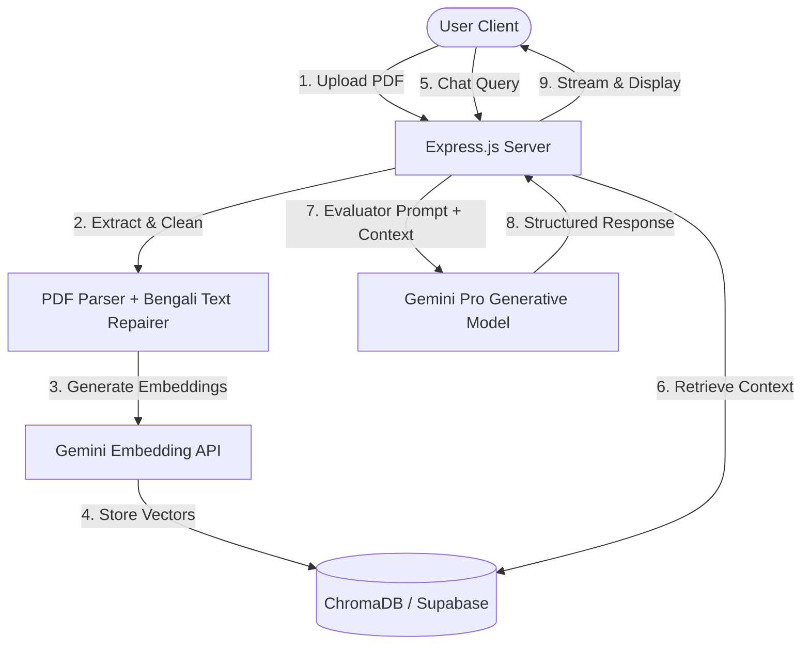

<div align="center">
  

  # 🧠 COGNITIVE AI
  ### Bengali-Optimized Smart AI PDF Assistant & Evaluator

  [](https://react.dev/)
  [](https://vite.dev/)
  [](https://tailwindcss.com/)
  [](https://expressjs.com/)
  [](https://ai.google.dev/)
  [](https://supabase.com/)
</div>

---

## 🌟 Introduction

**Cognitive AI** is an advanced, production-grade Retrieval-Augmented Generation (RAG) platform optimized for processing PDF documents, with **specialized native support for Bengali text correction and HSC/SSC-style academic answer evaluation**. 

Using **Google Gemini Pro** for generation and embeddings, **ChromaDB / Supabase Vector Store** for semantic search, and a responsive **React 19 + Tailwind v4 + Framer Motion** frontend, Cognitive AI delivers a seamless split-screen PDF reading and conversational experience.

---

## ✨ Key Features

### 🇧🇩 1. Specialized Bengali Text Engine
* **Character Reconstruction & Repair:** Built-in heuristics (`bengaliCleaner.js`) to repair corrupted Bengali characters (e.g., visual-to-logical reordering of *e-kar* `{` and *i-kar* `²`) commonly caused by standard PDF parsers.
* **Bengali-Optimized Chunking & Processing:** Smart semantic splitting of complex Bengali texts for high-precision retrieval.

### 🎓 2. HSC/SSC Creative Exam Evaluator
* **Strict Evaluation Guidelines:** Toggle the examiner mode to receive structured HSC/SSC-style answers following guidelines (ক, খ, গ, ঘ sections) containing:
  * **ক-নম্বর (জ্ঞানমূলক):** Direct 1-paragraph definition (2-3 sentences).
  * **খ-নম্বর (অনুধাবনমূলক):** 2-paragraph explanation & analysis.
  * **গ-নম্বর (প্রয়োগমূলক):** 3-paragraph context mapping & application.
  * **ঘ-নম্বর (উচ্চতর দক্ষতামূলক):** 4-paragraph critical review & evaluation.

### 💻 3. Premium Interactive Workspace
* **Split Reader Interface:** Read your PDF files and chat with the AI assistant side-by-side.
* **Knowledge Graph:** Visualize connections, entities, and topics within your uploaded documents.
* **Dashboard Analytics:** Track document libraries, queries, storage, and study metrics with interactive **Recharts** visualizations.
* **Custom Collections:** Group and organize your documents by folders, categories, or courses.

---

## 🏗️ System Architecture



---

## 🛠️ Tech Stack

| Component | Technology | Description |
| :--- | :--- | :--- |
| **Frontend** | **React 19**, **Vite**, **TypeScript**, **Tailwind CSS v4**, **Motion (Framer)** | Modern, ultra-smooth, responsive user interface with glassmorphism aesthetics. |
| **Backend** | **Node.js**, **Express.js (v5)**, **Multer** | REST API handling secure uploads, auth checking, and AI processing orchestrations. |
| **Database & Auth**| **Supabase** | Handles User Registration, Authentication (JWT), User Profiles, and metadata storage. |
| **Vector Database**| **ChromaDB** & **Supabase Vector** | High-performance vector databases storing split-text embeddings. |
| **AI/LLM** | **Google Gemini SDK** (`@google/generative-ai`) | Generates state-of-the-art response structures and semantic text embeddings. |
| **Frameworks** | **LangChain** (`@langchain/community`) | Used for semantic document loading, splitting, and vectorizing. |

---

## 🚀 Installation & Setup

### Prerequisites
* **Node.js** (v18.x or above)
* **npm** or **yarn**
* Google AI Studio (Gemini) API Key
* Supabase Project & URL
* ChromaDB Instance (Cloud/Local)

---

### 1. Server Configuration
Navigate to the server directory:
```bash
cd server
npm install
```

Create a `.env` file inside the `server/` directory and configure the environment variables:
```env
PORT=3001
CLIENT_URL=http://localhost:3000

# Gemini Credentials
GEMINI_API_KEY=your_gemini_api_key_here

# Chroma Vector DB Settings
CHROMA_HOST=api.trychroma.com
CHROMA_API_KEY=your_chroma_api_key
CHROMA_TENANT=your_chroma_tenant_id
CHROMA_DATABASE=rag

# Supabase Credentials
SUPABASE_URL=https://your-project-id.supabase.co
SUPABASE_SERVICE_ROLE_KEY=your_supabase_service_role_key
```

Start the backend server in development mode:
```bash
npm run start
```
*The server will run on port `3001`.*

---

### 2. Client Configuration
Navigate to the client directory:
```bash
cd ../client
npm install
```

Create a `.env` file inside the `client/` directory:
```env
VITE_SUPABASE_URL=https://your-project-id.supabase.co
VITE_SUPABASE_PUBLISHABLE_KEY=your_supabase_publishable_key
VITE_API_URL=http://localhost:3001/api/v1
```

Start the client development server:
```bash
npm run dev
```
*The frontend application will be hosted on [http://localhost:3000](http://localhost:3000).*

---

## 📂 Project Structure

```
rag-pdf/
├── client/                 # React 19 Frontend Web Application
│   ├── src/
│   │   ├── components/     # UI Components (chat, common, layouts, pdf)
│   │   ├── context/        # Auth and global application state providers
│   │   ├── pages/          # Analytics, Dashboard, PDF Reader, ChatHome, Settings, etc.
│   │   ├── utils/          # API utilities and Supabase integrations
│   │   └── App.tsx         # App entry and react-router routing rules
│   └── package.json
│
├── server/                 # Node.js + Express Backend Server
│   ├── src/
│   │   ├── controllers/    # chatController, uploadController
│   │   ├── middlewares/    # auth.middleware, error.middleware, multer.middleware
│   │   ├── routes/         # API endpoints definitions (apiRoutes)
│   │   ├── utils/          # bengaliCleaner.js, errorHandler.js
│   │   └── index.js        # Server initialization and middleware setups
│   └── package.json
└── README.md               # Main Project documentation
```

---

## 💡 How to Use
1. **Sign Up / Log In**: Create an account on the client app (authenticated securely via Supabase).
2. **Upload a PDF**: Upload any textbook or PDF document in the **PDF Library** or **Dashboard**.
3. **Bengali Text Correction**: If uploading a Bengali PDF, the server automatically executes the cleaning script to fix common font rendering errors.
4. **Interactive Chat**: 
   * Open the **Chat** or **Reader Split** window.
   * Ask questions about your PDF.
   * Toggle the **HSC/SSC Exam Evaluator Mode** to get structured, evaluation-ready questions and answers in Bengali (ক, খ, গ, ঘ sections).

---

## 📄 License
This project is licensed under the ISC License.
